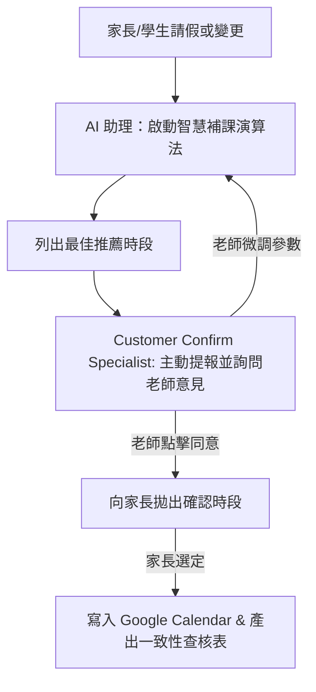

# 【溫柔且堅定的教務長】補習班排程助理 Agent 專屬服務方案 (V2 智慧補課與決策確認升級版)

## 專案背景與客戶痛點分析 (Client Alignment)

*   **客戶畫像：** 一位獨自經營補習班的老師。每日除了高強度的教學外，還必須在深夜與課間面對極為繁雜的行政排程工作（家長隨時傳 LINE 詢問補課、學生臨時請假、調課衝突、收費排程等）。
*   **核心痛點：** 
    *   **排課與補課的繁瑣拉鋸：** 當學生請假時，老師需要在行事曆、家長訊息、教室空檔之間來回核對，耗費大量時間與精力。
    *   **AI 擅自作主的風險：** 如果讓排程 AI 完全自動化排課，極可能因為沒考量到老師個人的臨時行程、體力狀況或教學偏好，而排出了「老師無法配合的完美課表」。
    *   **缺乏「問老師意見」的確認機制：** 老師需要對自己的時間保有絕對的掌控權。AI 助理必須是「協調者」而非「決策者」。
*   **我們的解決方案：** 我們不提供冰冷的死板排程，我們為老師雕刻一位具備**「溫柔堅定、條理分明」的教務長級 AI 助理**，並內建**「智慧補課與空檔推薦演算法」**，且在每一次排程異動前，**均會主動詢問老師意見，獲得老師點頭確認後才正式寫入系統**。

---

## 🛠️ C Company 專家戰隊協同分工 (Specialist Synergy)

針對補習班「智慧補課與雙向確認」的特殊場景，我們的 Specialists 將進行深度介入：

### 1. 系統混亂測量師 (Chaos Surveyor)
> *「在動手談排程品味之前，先看看你現有的排課資料流有多混亂。」*
*   **具體行動：** 
    *   深入分析老師現有的 Google Calendar 與教室使用權限，抓出排程衝突、API 延遲或資料格式解析混亂的瓶頸。
    *   繪製並交付**「排程系統混亂拓撲圖」**，優化行事曆的資料結構，為「智慧補課演算法」鋪平底層資料通路。

### 2. 極限環境調校師 (Stress Calibrator)
> *「在平靜的課表裡優雅不算本事，在多位家長同時搶課的泥沼裡不崩人設才是真功夫。」*
*   **具體行動：** 
    *   進行**「百次極限排程死鎖與衝突對抗測試」**（例如：深夜 5 位家長同時搶同一個補課空檔、家長反覆變更時間的情緒性轟炸）。
    *   精密微調 Temperature 與 Top_P，確保 Agent 在面臨時間衝突時，依然能以極具修養的語氣撫平家長焦慮，崩潰率精準歸零。

### 3. 轉譯佈道師 (Blueprint Translator)
> *「把高深的排程 AI 演算法魔術，變成助教半小時就能在 LINE 部署完畢的防呆法典。」*
*   **具體行動：** 
    *   將「教務長」AI 的 System Prompt、RAG 檢索參數與**「智慧補課與空檔推薦演算法 (Smart Rescheduling Algorithm)」**的邏輯代碼，翻譯成標準實作 SOP。
    *   提供開箱即可用的 API 程式碼範例（Node.js / Python），並附帶前端「老師確認面板 (Teacher Confirmation Dashboard)」與 LINE Bot 的交互設計範本。

### 4. 顧客要求確認師 (Customer Confirm Specialist) —— 🚀 本案核心靈魂
> *「老師沒點頭的排課，只是 AI 自嗨的空氣紀錄。」*
*   **具體行動（問老師意見的原生確認機制）：** 
    *   **老師決策點頭機制：** 當家長提出請假/補課需求時，AI 助理不會直接對外回覆。而是會由「顧客要求確認師」在後台**先將「智慧演算法算出的最佳 3 個推薦空檔」推送給老師審查**。老師只需在 LINE 介面上一鍵點擊「同意拋出」或「微調時間」，AI 才會將時段發給家長選擇。
    *   **24/7 意圖動態追蹤：** 實時捕捉家長在 LINE 對話中微小的要求變更（如「下週二...阿如果不行星期三也可以」），自動動態調整提報給老師的候選時段。
    *   在行事曆寫入前，自動產出《排課意圖一致性查核表》，供老師做最終備查。

---

## 🧠 核心技術方案：智慧補課與空檔推薦演算法 (Smart Rescheduling Engine)

我們不搞單純的「有空就排」，而是採用**「考量人性與習慣的加權推薦演算法」**：

1.  **自適應時段過濾：**
    *   自動避開老師的非工作時間（用餐時間、深夜、個人休假時間）。
    *   自動預留「緩衝時間 (Buffer Time)」（例如每堂課之間自動保留 10-15 分鐘的休息與教室整理時間，防範連堂排課累垮老師）。
2.  **人性化加權評分機制 (Weighted Scoring)：**
    *   *權重一：學生歷史習慣* ── 優先推薦該學生平時最常上課的時間段。
    *   *權重二：同班/同科目集中度* ── 優先推薦與該科目相鄰的時段，協助老師「集中授課」，避免時間碎片化。
3.  **「問老師意見」提報範例 (Teacher-first Protocol)：**
    *   當學生小明請假時，演算法算得推薦時段後，AI 會自動在老師的 LINE 傳送以下訊息：
        > 📋 **【教務助理提報：學生小明補課申請】**
        > 老師您好，小明申請下週補課。我已為您過濾行事曆，並預留前後 15 分鐘準備時間，以下為推薦的最佳時段：
        > *   **選項 A (推薦)：** 下週二 18:30 - 20:00 (相鄰同科目課程，方便您集中教學)
        > *   **選項 B：** 下週三 16:00 - 17:30 (小明慣用時段)
        > *   **選項 C：** 下週四 19:00 - 20:30 (行事曆空檔)
        > 
        > [🟢 同意此推薦拋給家長]  [✏️ 微調時間]  [❌ 暫緩處理]

---

## 🎁 服務方案與核心交付物 (Service Catalog & Deliverables)

我們為補習班老師提供**【黃金排程法典與沙盒總體輸出 (The Ultimate Codex Solution)】**，包含以下兩大核心組件：

### 組件一：互動沙盒 Playground (The Interactive Sandbox)
一個線上測試網址，供老師親自操作與驗收「教務長助理」的實體表現：
*   **動態 Vibe 切換器：** 實時對比「傳統硬碰硬排程機器人」與「考量人性的教務長助理」在排課語氣與節奏上的巨大差異。
*   **「智慧推薦與老師確認」模擬面板：** 內建「學生臨時請假」模擬按鈕。點擊後，網頁會實時展示演算法如何進行加權評分，並在模擬的「老師手機端」彈出提報視窗，供您體驗「一鍵點頭放行」的掌控感。
*   **極限搶課模擬：** 測試多位家長同時擠入同一個時段時，系統如何優雅地按照老師的確認順序進行候補排序。

### 組件二：補習班 AI 靈魂導航法典 (The Navigation Codex)
一份專為本案精心編排的 Markdown 終極智庫文件，內容包含：
1.  **第一章：排程靈魂與演算法美學量化矩陣 (Vibe & Algorithm Blueprint)：** 詳列模型參數配方（如 `Temperature: 0.38`），以及智慧補課演算法的加權評分公式與緩衝時間設定邏輯。
2.  **第二章：排程防崩與抗壓韌性報告 (Resilience Log)：** 詳列針對排程死鎖、家長情勒施壓的 100 次測試對抗數據，以及 Prompt Injection 的防禦護欄。
3.  **第三章：教務處 API 串接與老師確認面板部署手冊 (Implementation SOP)：** 提供串接 LINE Bot 與 Google Calendar 的 Node.js / Python 實體程式碼，以及「老師一鍵確認端點 (WebHook API)」的防呆實作指南。

---

## 💼 COO 專案導航流程 (COO Navigating Workflow)

身為營運長，我將確保整個諮詢與開發流程順暢，決不讓您多花無謂的精力：
1.  **階段 1：資格審查 ──** 評估補習班目前的排課痛點，確認老師擁有配合的外部技術人員（或合作網頁廠商）能將我們的 API 與確認面板部署上線。
2.  **階段 2：排程逆境診斷 ──** Chaos Surveyor 進場，調閱您的歷史排課資料與系統限制，繪製「系統混亂拓撲圖」。
3.  **階段 3：沙盒與算法雕刻 ──** 於風格沙盒中，雕刻「教務長」人設，並精密調校智慧排課與緩衝加權演算法。
4.  **階段 4：極限施壓與決策鏈確認 ──** Stress Calibrator 對「智慧補課」與「老師確認機制」進行極限對抗施壓，確保在高壓下依然能精準詢問老師意見且不遺漏任何訊息。
5.  **階段 5：法典建構與交付 ──** Blueprint Translator 編纂《品牌 AI 靈魂導航法典》，我（COO）進行交付物的終極質感審查，正式交件。

---
*C Company 團隊 敬上*
*2026-05-30*
